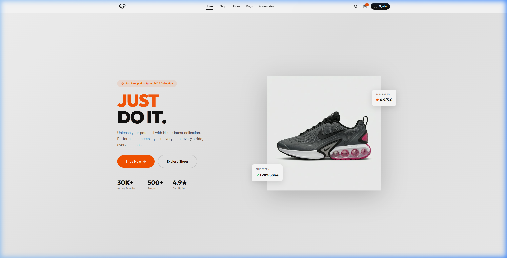
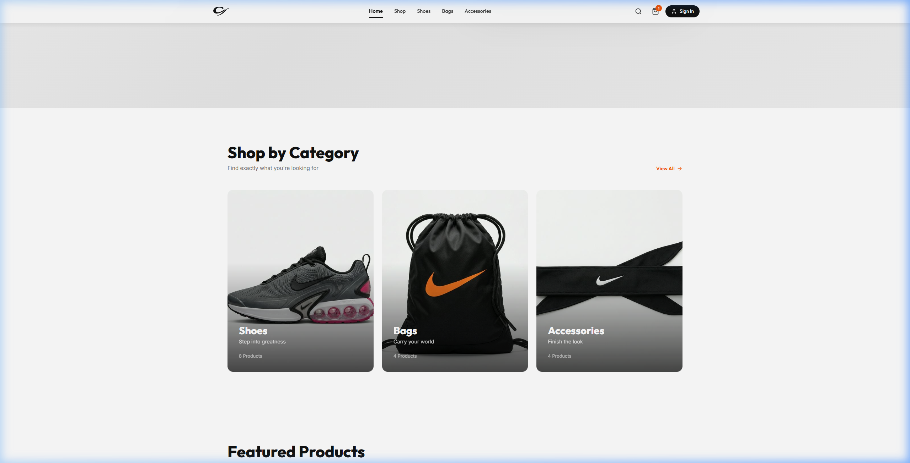
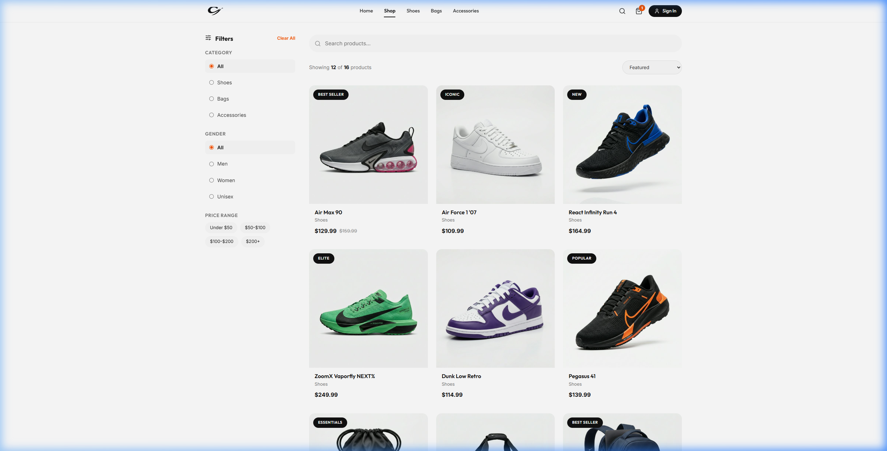
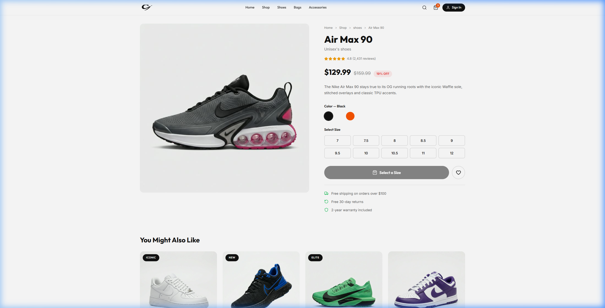
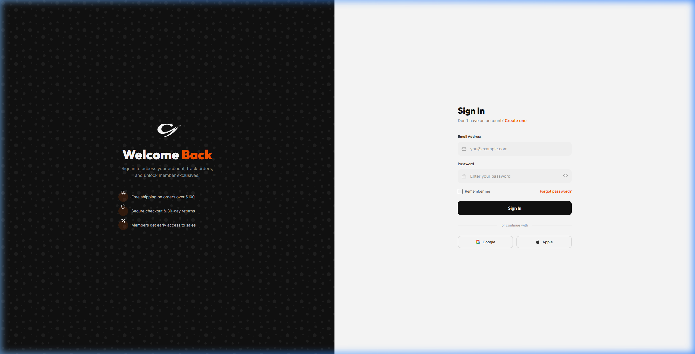
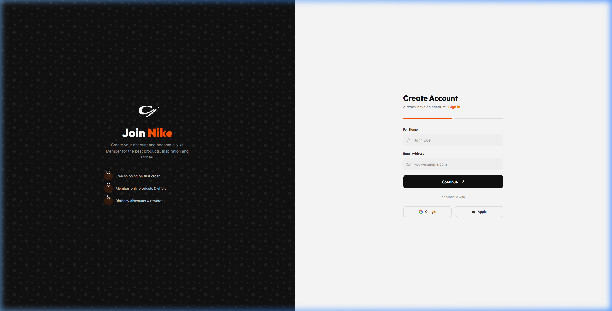

# Nike — E-Commerce Store

A modern, fully animated Nike-inspired e-commerce web application built with React. Features a premium design with smooth animations, product catalog, authentication, and a complete shopping experience.

## ✨ Features

- **Animated Hero** — Full-viewport hero section with floating cards and parallax elements
- **Product Catalog** — Browse shoes, bags, and accessories with filters, search, and sorting
- **Authentication** — Login and Register pages with form validation and social login options
- **Product Detail** — Gallery view with color/size selectors and add-to-cart animation
- **Shopping Cart** — Full cart management with quantity controls and order summary
- **Smooth Transitions** — Page transitions and scroll-triggered animations powered by Framer Motion
- **Responsive** — Fully responsive design with mobile navigation

## 📸 Screenshots

### Home Page


### Categories


### Product Catalog


### Product Detail


### Login


### Register


## 🛠️ Tech Stack

| Technology | Purpose |
|-----------|---------|
| **React 18** | UI framework |
| **Vite** | Build tool & dev server |
| **React Router v6** | Client-side routing |
| **Framer Motion** | Animations & transitions |
| **Lucide React** | Icons |
| **CSS Custom Properties** | Design system & theming |

## 🚀 Getting Started

```bash
# Clone the repo
git clone https://github.com/YOUR_USERNAME/nike-store.git

# Install dependencies
npm install

# Start development server
npm run dev
```

Open [http://localhost:5173](http://localhost:5173) in your browser.

## 📦 Build for Production

```bash
npm run build
```

The production build will be in the `dist/` folder.

## 🌐 Deployment

This project is optimized for deployment on **Vercel**:

1. Push your code to GitHub
2. Go to [vercel.com](https://vercel.com) → Import Git Repository
3. Select your repo — Vercel auto-detects Vite and deploys

## 📁 Project Structure

```
src/
├── components/       # Reusable UI components
│   ├── Navbar.jsx    # Navigation with glassmorphism
│   ├── Footer.jsx    # Multi-column footer
│   └── CartDrawer.jsx # Slide-in cart panel
├── pages/            # Route pages
│   ├── Home.jsx      # Landing page with hero
│   ├── Login.jsx     # Sign in page
│   ├── Register.jsx  # Sign up page
│   ├── Products.jsx  # Product listing
│   ├── ProductDetail.jsx # Single product view
│   └── Cart.jsx      # Shopping cart
├── context/          # React context providers
│   ├── AuthContext.jsx
│   └── CartContext.jsx
├── data/
│   └── products.js   # Product catalog data
└── index.css         # Design system & global styles
```

## 📝 License

This project is for educational purposes only. Nike and the Swoosh logo are trademarks of Nike, Inc.
